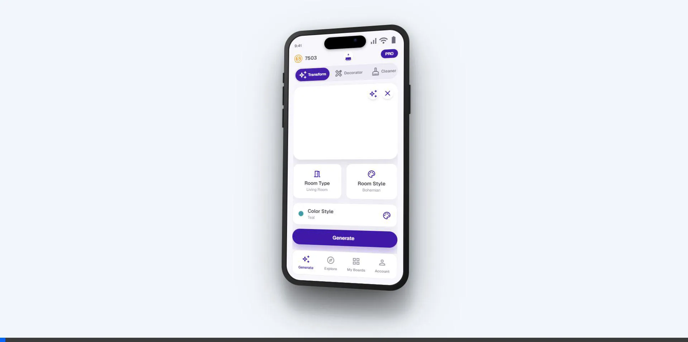
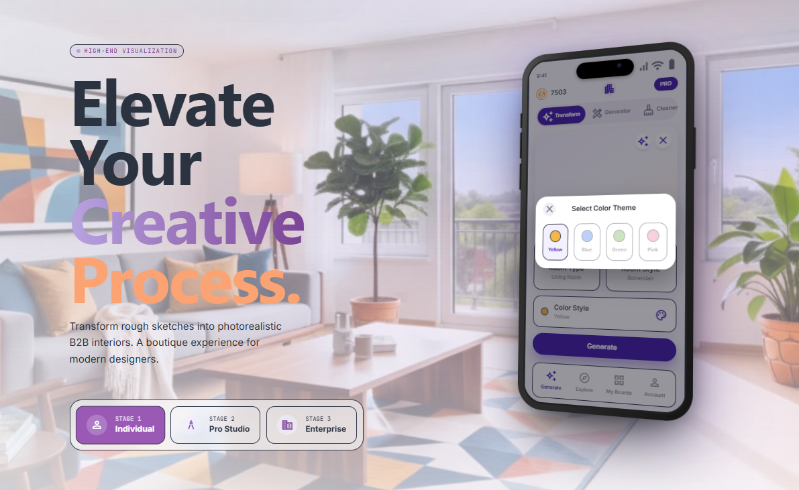
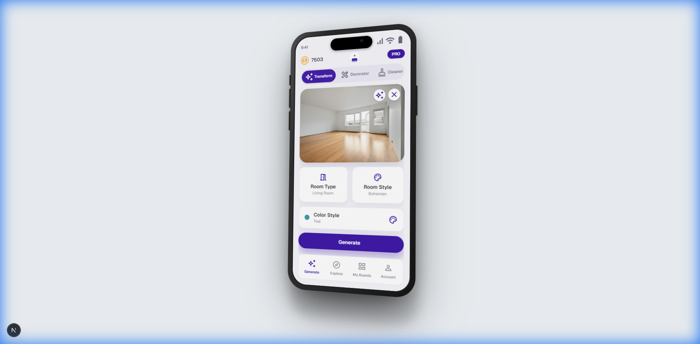
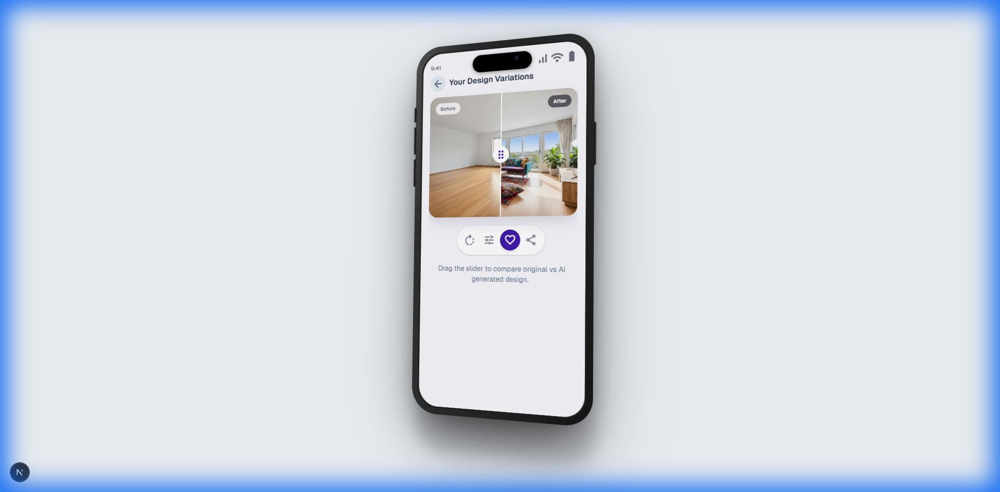
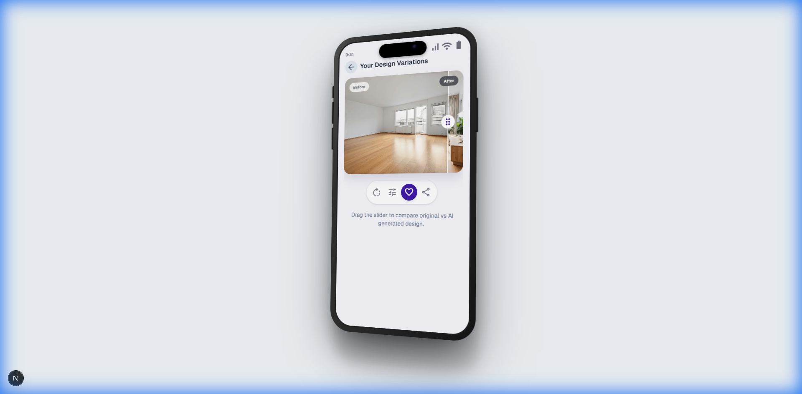

# CSS-Only 3D iPhone Mockup

<div align="center">
  
  
</div>

This is a standalone Next.js application showcasing a **CSS-Only 3D iPhone Mockup**. It provides a highly realistic, interactive, and performant 3D phone frame using only CSS transforms.

## From Our Studio

We build Styly, a design playground where you can explore and transform spaces with AI-assisted styling. This mockup is part of our visual experiments, and we thought it was cool enough to share with the community.

- https://beta.styly.io

## Features

- **Pure CSS 3D Transforms**: No WebGL or heavy 3D libraries required.
- **Interactive Experience**: Drag to rotate the device in 3D space.
- **Realistic Details**: Features multi-layer shadows, metallic gradients, and correct perspective.
- **Dynamic Island**: Includes a styled notch area.
- **High Performance**: Optimized using GPU-accelerated transforms.

## Gallery

<div align="center">
  
  
  
</div>

## Getting Started

1. Install dependencies:
   ```bash
   npm install
   ```

2. Run the development server:
   ```bash
   npm run dev
   ```

3. Open [http://localhost:3000](http://localhost:3000) (or the port shown in your terminal) to view the demo.

## Usage in Your Project

Copy `src/components/IPhoneMockup.tsx` to your project. It requires Tailwind CSS.

```tsx
import { IPhoneMockup } from './IPhoneMockup';

export default function Page() {
  return (
    <div className="flex items-center justify-center min-h-screen bg-gray-100">
      <IPhoneMockup scale={0.9}>
        <div className="w-full h-full bg-white p-4">
            <h1>My Content</h1>
        </div>
      </IPhoneMockup>
    </div>
  );
}
```

## Tech Stack

- **Framework**: Next.js 16
- **Styling**: Tailwind CSS 4
- **Language**: TypeScript
